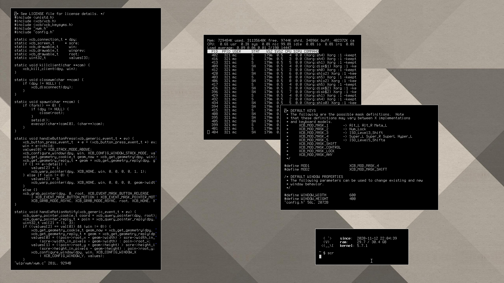

# XCB Window Manager (xwm) User Contributed Content

The following is a repository for users to collaborate and share `xwm` patches, media and other content. 

## Patches

Patches can be fairly large and, therefore, will not be hosted as part of the regular git source.  For instructions on how to apply these patches, refer to the *PATCHES* section of the [README](https://raw.githubusercontent.com/mcpcpc/xwm/main/README).

### New Patch Contribution Rules

1.   The patch author assumes responsibility for the continued support and maintainenance of their new patch.
2.   All new patches shall be placed in the `patches/` folder. 
3.   When creating a [Pull Request](https://github.com/mcpcpc/xwm-patches/pulls), remember to update the [Patch Index](#patch-index) section of this file below.
4.   All new patches can be applied using the `-p0` flag.
5.   When reporting existing patch [Issues](https://github.com/mcpcpc/xwm-patches/issues) or enhancement opportunities, be sure to mention the author (as mentioned in the index).

### Patch Index

| Name | Author | Description |
|-|-|-|
| [example](patches/example.patch) | [mcpcpc](https://github.com/mcpcpc) | a brief description of the patch, functionality and usage |

## Screenshots

The following is a collective of user contributed screenshots.  If you woulld like to make your own contribution, create a new [Pull Request](https://github.com/mcpcpc/xwm-patches/pulls), place your image in the `screenshots/` directory and update the index below (with a brief description in the Alt text).

